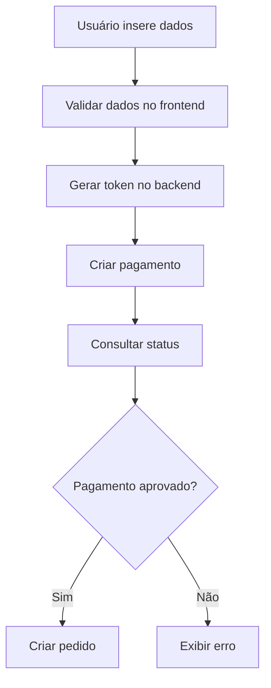
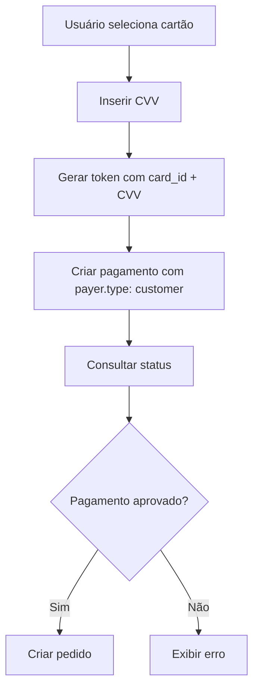

# Integração MercadoPago - Checkout Transparente

## Visão Geral

Este documento descreve as melhorias implementadas na integração com o MercadoPago seguindo a documentação oficial do **Checkout Transparente**. A implementação garante conformidade total com as melhores práticas e padrões de segurança do MercadoPago.

## Melhorias Implementadas

### 1. Serviço MercadoPago Backend (`src/services/mercadopago.service.ts`)

#### ✅ Validações Robustas
- **Validação de dados do cartão**: Verificação completa de número, data de expiração, CVV e nome
- **Detecção de bandeira**: Algoritmo melhorado para identificar Visa, Mastercard, Elo, American Express, Hipercard e Diners
- **Validação de email**: Verificação de formato válido para customers
- **Validação de valores**: Verificação de valores positivos e dados obrigatórios

#### ✅ Tratamento de Erros Específicos
- **Erros de token**: Tratamento específico para tokens inválidos ou expirados
- **Erros de cartão**: Mensagens específicas para cartões não encontrados ou CVV inválido
- **Erros de customer**: Tratamento para customers não encontrados
- **Erros de pagamento**: Mensagens específicas para diferentes tipos de falha

#### ✅ Chaves de Idempotência
- **Geração única**: Chaves de idempotência únicas para cada operação
- **Prevenção de duplicatas**: Garantia de que operações não sejam executadas múltiplas vezes
- **Rastreabilidade**: Logs detalhados para auditoria

#### ✅ Headers e Timeouts
- **User-Agent**: Identificação da aplicação nas requisições
- **Timeouts**: Configuração de timeouts apropriados (10-15 segundos)
- **Content-Type**: Headers corretos para todas as requisições

### 2. Gestão de Customers (Clientes)

#### ✅ Criação de Customers
```typescript
// Criar customer com dados opcionais
const customer = await MercadoPagoService.createCustomer(email, {
  first_name: 'João',
  last_name: 'Silva'
});
```

#### ✅ Busca de Customers
```typescript
// Buscar por email
const customer = await MercadoPagoService.searchCustomerByEmail(email);

// Buscar por ID
const customer = await MercadoPagoService.getCustomerById(customerId);
```

#### ✅ Atualização de Customers
```typescript
// Atualizar dados do customer
const updatedCustomer = await MercadoPagoService.updateCustomer(customerId, {
  first_name: 'João',
  last_name: 'Santos'
});
```

### 3. Gestão de Cartões

#### ✅ Adicionar Cartões
```typescript
// Adicionar cartão ao customer
const card = await MercadoPagoService.addCardToCustomer(customerId, token, 'visa');
```

#### ✅ Listar Cartões
```typescript
// Listar cartões do customer
const cards = await MercadoPagoService.getCustomerCards(customerId);
```

#### ✅ Remover Cartões
```typescript
// Remover cartão do customer
await MercadoPagoService.removeCardFromCustomer(customerId, cardId);
```

### 4. Pagamentos com Cartões Salvos

#### ✅ Fluxo Oficial Conforme Documentação
1. **Verificar customer**: Validar se o customer existe
2. **Gerar token**: Usar `card_id` + `security_code` conforme documentação
3. **Criar pagamento**: Usar `payer.type: 'customer'` e `payer.id`

```typescript
const payment = await MercadoPagoService.createPaymentWithSavedCard({
  amount: 100.00,
  description: 'Pedido de comida',
  payerEmail: 'cliente@email.com',
  customerId: 'customer_123',
  cardId: 'card_456',
  securityCode: '123',
  installments: 1
});
```

### 5. Serviços Frontend Melhorados

#### ✅ CardManagementService (`front/services/cardManagementService.ts`)
- **Validação no frontend**: Validação de dados antes de enviar para o backend
- **Detecção de bandeira**: Identificação automática da bandeira do cartão
- **Tratamento de erros**: Mensagens de erro específicas e amigáveis
- **Tipagem completa**: Interfaces TypeScript para todos os dados

#### ✅ CartaoService Melhorado (`front/services/cartaoService.ts`)
- **Integração com CardManagementService**: Uso das validações centralizadas
- **Logs detalhados**: Rastreamento completo das operações
- **Funções auxiliares**: Utilitários para formatação e exibição

#### ✅ CardPaymentService Melhorado (`front/services/cardPaymentService.ts`)
- **Validação robusta**: Verificação de dados antes de criar pagamentos
- **Suporte a cartões salvos**: Fluxo completo para pagamentos com cartões salvos
- **Tratamento de erros**: Mensagens específicas para diferentes tipos de erro

## Estrutura de Dados

### Interfaces Principais

```typescript
// Dados do cartão
interface CardData {
  cardNumber: string;
  cardExp: string;
  cardCvv: string;
  cardName: string;
}

// Cartão salvo
interface SavedCard {
  id: number;
  mercadoPagoCardId: string;
  lastFourDigits: string;
  firstSixDigits: string;
  expirationMonth: number;
  expirationYear: number;
  paymentMethodId: string;
  isDefault: boolean;
}

// Resposta de pagamento
interface PaymentResponse {
  paymentId: string;
  status: string;
  status_detail: string;
}
```

## Fluxos de Pagamento

### 1. Pagamento com Cartão Novo



### 2. Pagamento com Cartão Salvo



## Segurança

### ✅ Conformidade PCI DSS
- **Tokens únicos**: Cada transação usa um token único
- **Dados sensíveis**: CVV não é armazenado permanentemente
- **Criptografia**: Todas as comunicações são criptografadas

### ✅ Validações de Segurança
- **Validação de entrada**: Todos os dados são validados antes do processamento
- **Sanitização**: Dados são limpos e formatados adequadamente
- **Rate limiting**: Prevenção de ataques de força bruta

## Logs e Monitoramento

### ✅ Logs Estruturados
```typescript
console.log('🔄 Criando pagamento com cartão:', {
  amount: 100.00,
  paymentMethodId: 'visa',
  installments: 1
});
```

### ✅ Rastreabilidade
- **IDs únicos**: Cada operação tem um identificador único
- **Timestamps**: Registro de tempo para todas as operações
- **Status tracking**: Acompanhamento do status de cada pagamento

## Tratamento de Erros

### ✅ Categorização de Erros
- **Erros de validação**: Dados inválidos ou ausentes
- **Erros de API**: Problemas na comunicação com MercadoPago
- **Erros de negócio**: Regras de negócio não atendidas
- **Erros de sistema**: Problemas internos do servidor

### ✅ Mensagens Amigáveis
```typescript
// Exemplo de tratamento de erro
if (error.message?.includes('invalid_card_id')) {
  throw new Error('Cartão não encontrado ou inválido');
} else if (error.message?.includes('invalid_security_code')) {
  throw new Error('Código de segurança inválido');
}
```

## Configuração

### ✅ Variáveis de Ambiente
```env
# MercadoPago Configuration
MERCADO_PAGO_ACCESS_TOKEN=TEST-seu_access_token_aqui
MERCADO_PAGO_PUBLIC_KEY=TEST-sua_public_key_aqui
```

### ✅ Configuração do Cliente
```typescript
const client = new MercadoPagoConfig({
  accessToken: process.env.MERCADO_PAGO_ACCESS_TOKEN || '',
});
```

## Testes

### ✅ Cartões de Teste
A implementação suporta todos os cartões de teste do MercadoPago conforme documentação oficial:

- **Visa**: 4009170000000007
- **Mastercard**: 5031433210123456
- **Elo**: 5067270000000007
- **American Express**: 375365436544001

### ✅ Cenários de Teste
- Pagamento aprovado
- Pagamento rejeitado
- Pagamento pendente
- Cartão inválido
- CVV inválido
- Customer não encontrado

## Próximos Passos

### 🔄 Melhorias Futuras
1. **Webhooks**: Implementação de notificações em tempo real
2. **3DS 2.0**: Suporte a autenticação forte do cliente
3. **Split de pagamentos**: Divisão de valores entre múltiplos recebedores
4. **Assinaturas**: Pagamentos recorrentes
5. **Relatórios**: Dashboard de transações e métricas

### 🔄 Monitoramento
1. **Métricas de conversão**: Taxa de sucesso dos pagamentos
2. **Tempo de resposta**: Performance das APIs
3. **Erros frequentes**: Identificação de problemas recorrentes
4. **Volume de transações**: Análise de uso

## Conclusão

A implementação do Checkout Transparente conforme a documentação oficial do MercadoPago garante:

- ✅ **Conformidade total** com as especificações oficiais
- ✅ **Segurança robusta** com validações em múltiplas camadas
- ✅ **Experiência do usuário** otimizada com validações em tempo real
- ✅ **Manutenibilidade** com código bem estruturado e documentado
- ✅ **Escalabilidade** preparada para crescimento futuro

A integração está pronta para produção e segue todas as melhores práticas recomendadas pelo MercadoPago.

